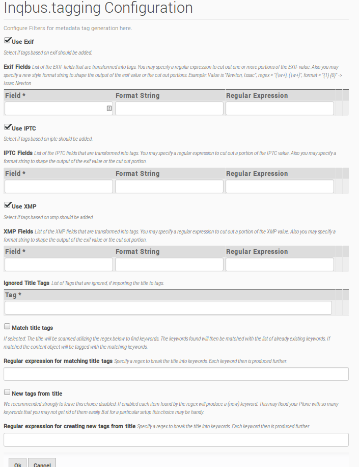

Introduction
============

This module allows automatic tagging for all content types and specially Images.
It generates tags from titles and Image-Meta-Data like Exif, Xmp and IPTC.

It also helps to manage existing Tags based on different Configurations and
provides Image-Previews in `folder_contents`-View.

Requirements
============

* Plone 5
* z3c.forms
* A browser with javascript support
* jquery 1.4.3 or later

Installation
============

Add inqbus.tagging to your buildout eggs.::

    eggs=\
        ...
        inqbus.tagging

Configuration
=============

Manage existing Tags
--------------------

For managing existing tags you can use a modified version of `Products.PloneKeywordManager`.

Here you can join tags used for the same content or delete not wanted tags.

Configure Auto-Tagging
----------------------

For adding automatically generated tags you have to configure `inqbus.tagging` using
the `Inqbus Tagging Settings` in Site Setup.

Here you can decide which information and meta-information should be used for
generating tags, which tags should be ignored and how meta-information should be
converted.

Select Tags by Tag Import
-------------------------

To make selecting meta-information more easier, you can use `Inqbus Tagging - Tag Imports`
in Site Setup to select meta-fields.

Therefore select an image and press `ok`. A list of available fields will be displayed
including the value of the selected image as example.

Select your tags and press ok. All selected tags are added to the list in
`Inqbus Tagging Settings` and can be configured there.

Expanded Folder_contents-View
=============================

Image Preview
-------------

To make working with Images more easier a preview-column was
added to the `folder_contents`-View and can be selected like all other columns.

Retag
-----

To migrate existing objects you can use the `Retag`-Action in the `folder_contents`-View.

